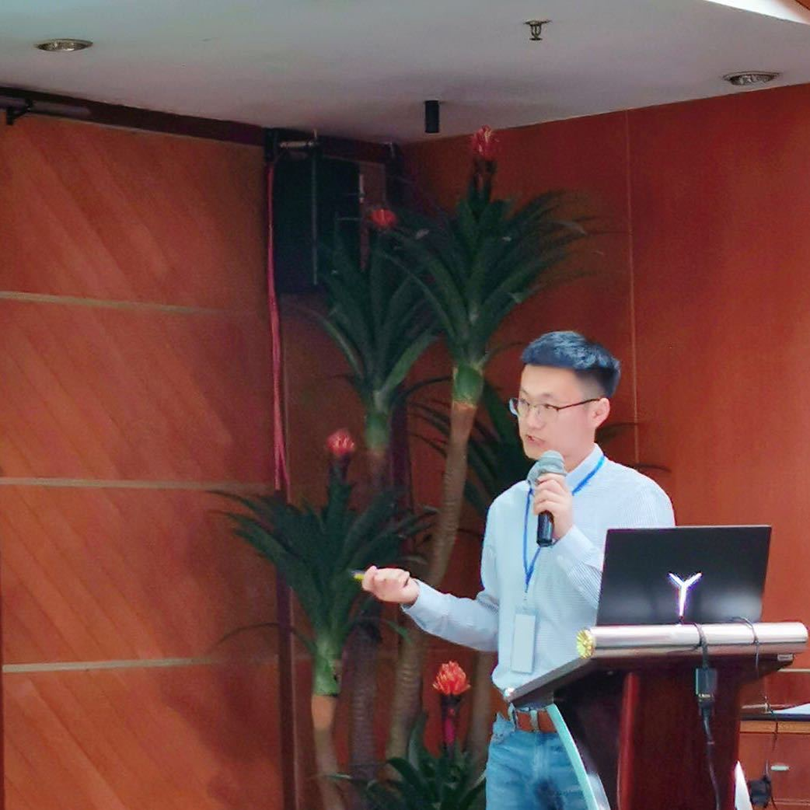

---
# You don't need to edit this file, it's empty on purpose.
# Edit theme's home layout instead if you wanna make some changes
# See: https://jekyllrb.com/docs/themes/#overriding-theme-defaults
layout: home
---

    

        
    

    

        
欢迎来到 NatCATmodeling

        
我是马健, 博士研究生，就读于北京师范大学减灾与应急管理研究院

        

           研究方向：区域地震风险模型、概率地震风险分析（PSHA）、暴露模型、风险模型的不确定性量化分析和巨灾保险设计
        

        

           2019年, 访学全球地震风险模型基金会(Global Earthquake Model Foundation)，师从 Dr. Vitor Silvia 和 Dr. Anirudh Rao，开发中国
           大陆住宅暴露模型
        

        

           2019-2020年，访学加拿大西安大略大学，师从 <a 
           href= "https://www.researchgate.net/profile/Katsuichiro_Goda/">Dr. Katsu Goda</a>,专注于中国地震PSHA模型开发和不确定性量化。
        

        
此博客致力分析巨灾风险模型的构建方法、研究动态、Openquake及其工具包和常用巨灾模型数据处理代码

    

